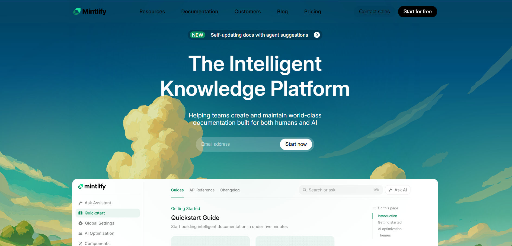
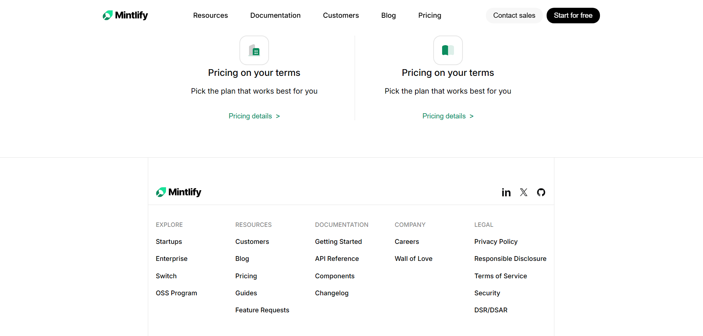

# Mintlify Clone
This project is a clone of the Mintlify documentation website, built using HTML and CSS. It serves as a practice project to enhance my skills in frontend development and design.

## Getting Started
Follow these steps to run the project locally.

1. Clone the repository:
   ```bash
   git clone https://github.com/Sum4nG/mintify-clone.git
   ```
2. Navigate to the project directory:
   ```bash
   cd mintlify-clone
   ```
3. Open the `index.html` file in your web browser to view the landing page.

## Screenshots




